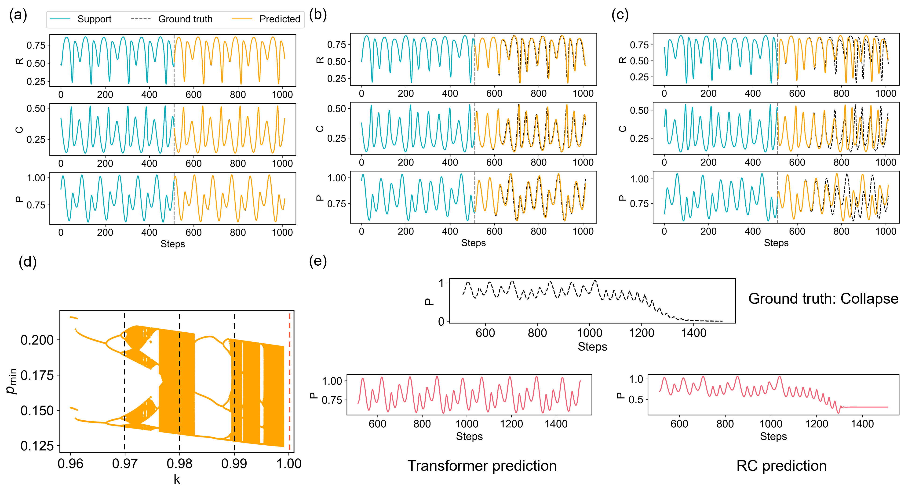

<h1 align="center">Can transformers predict system collapse in dynamical systems?</h1>

This repository contains code for evaluating transformer-based models as digital twins for predicting catastrophic collapse in nonlinear dynamical systems. Models are trained only on safe-regime time series and tested on unseen parameters that induce collapse, with a systematic comparison to reservoir computing (RC). While transformers perform well in multi-step forecasting within the training regime, they fail to predict collapse, whereas RC succeeds reliably.

The figure shows results for the chaotic food chain system. Both models accurately predict dynamics at training parameters, but when tested beyond the critical point, only RC captures the transient chaos and subsequent collapse; the transformer continues oscillating. This highlights a clear limitation of transformers in critical transition prediction.
